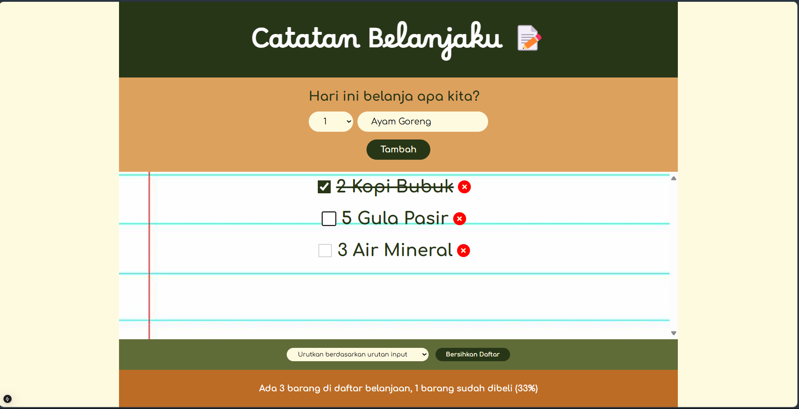
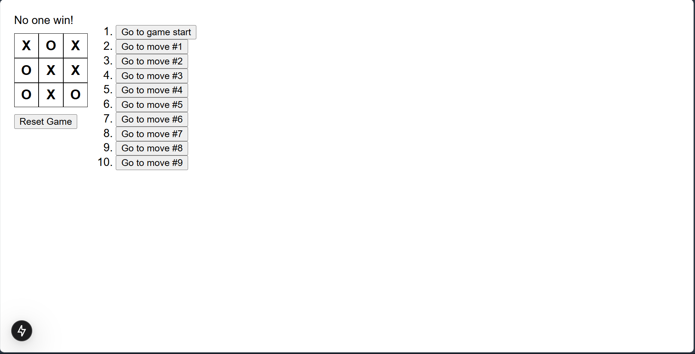

# Learn React Programming Language and Next.js Framework

Note: This project is created following tutorial of React programming language playlist in Web Programming Unpas Youtube Channel )

This repository includes code for learning React and Next.js. It includes some mini project which is created for comprehensive understanding. Unfortunately, this project cannot be run in Next.js Framework since the Next.js core file is not included in this repo (limitation of batch upload size).

As a preview, here provided the screenshot of some mini project's user interface (UI)

## Daftar Belanja

## Anime App

## Tic Tac Toe

